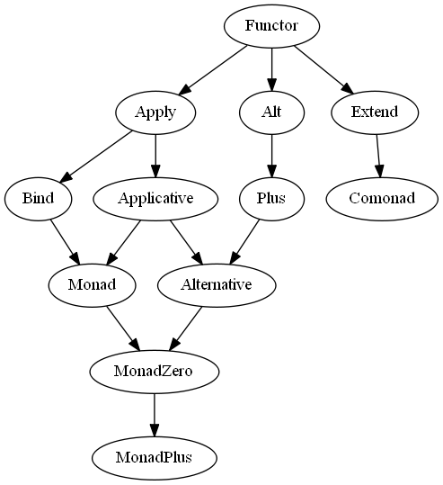

# purescript-control

[](https://github.com/purescript/purescript-control/releases)
[](https://travis-ci.org/purescript/purescript-control)
[](https://www.versioneye.com/user/projects/55848c2936386100150003de)

This library provides a range of utility functions for the classes in the `Functor`, `Applicative`, `Monad` hierarchy, along with additional classes such as `Alternative`, `MonadPlus`, `Comonad` and `Lazy`.

## Installation

```
bower install purescript-control
```

## Class hierarchy



## Documentation

Module documentation is [published on Pursuit](http://pursuit.purescript.org/packages/purescript-control).
