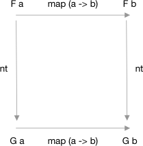

# Principled type conversions with Natural Transformations

[series banner](../resources/glitched-abstract.jpg)

> **Note: This is** **Tutorial 24** **in the series** **Make the leap from JavaScript to PureScript**. Be sure
> **to read the series introduction where we cover the goals & outline, and the installation,**
> **compilation, & running of PureScript. I’ll be publishing a new tutorial approximately**
> **once-per-month. So come back often, there’s a lot more to come!**
> 
> [Index](https:github.com/adkelley/javascript-to-purescript/tree/master/md) | [<< Introduction](https:github.com/adkelley/javascript-to-purescript) [< Tutorial 23](https:github.com/adkelley/javascript-to-purescript/tree/master/tut23)

In the [last tutorial](https://github.com/adkelley/javascript-to-purescript/tree/master/tut22/), we wrapped up our look at the `Traversable` type class with an example of how to process a sequence of `HTTP GET` requests using the member function `traverse`. Now, we'll move on to natural transformations in functional programming - what they are and the laws they must obey.  Then, in the next tutorial, we'll show how natural transformations come in handy during everyday programming.

I borrowed this series outline, and the JavaScript code samples with permission from the egghead.io course Professor Frisby Introduces Composable Functional JavaScript by
Brian Lonsdorf — thank you, Brian! A fundamental assumption is that you've watched his [video](https://egghead.io/lessons/javascript-principled-type-conversions-with-natural-transformations) on the topic before tackling the equivalent PureScript abstraction
featured in this tutorial. Brian covers the featured concepts exceptionally well, and I feel it's better that you understand its implementation in the comfort of JavaScript.

You'll find the text and code examples for this tutorial on [Github](https://github.com/adkelley/javascript-to-purescript/tree/master/tut22).  If you read something that you feel could be explained better, or a code example that needs refactoring, then please let me know via a comment or send me a pull request.  Also, before leaving, please give it a star to help me publicize these tutorials.

## Natural Transformations

As Brian mentions in his [video](https://egghead.io/lessons/javascript-principled-type-conversions-with-natural-transformations), a simple explanation of a natural transformation is that its a type conversion. It takes one functor holding an element `a` to another functor holding that same `a`.  You can think of it as a change in data constructors `F a -> G a`.  Let's implement a natural transformation by turning an `Either`  data constructor into a `Task` data constructor.

## Example: Transforming Either to a Task

Recall from [Tutorial 3](https://github.com/adkelley/javascript-to-purescript/blob/master/tut03/README.md) that `Either` is used to express a computation that may or may not succeed.  `Either a b` always contains a value of `a` or `b`; defined by the constructors `Left a` or `Right b`, but never both at the same time.  `Right b` is the idiomatic designation of a successful computation, while `Left a` means a failed computation.  We naturally transform `Either` to a `Task` by mapping `Left a` to `taskRejected` and `Right b` to `taskOf`.

Let's create this natural transformation `eitherToTask` with the following JavaScript code:

    const eitherToTask = e =>
      e.fold(Task.rejected, Task.of)
    
    eitherToTask(Right('nightingale')
    .fork(e => console.error('err', e),
          r => console.log('res', r))
    
    eitherToTask(Left('errrrr'))
    .fork(e => console.error('err', e),
          r => console.log('res', r))

In PureScript, the equivalent to `e.fold` is the `either` function from the [Data.Either](https://pursuit.purescript.org/packages/purescript-either/4.1.1/docs/Data.Either#v:either) module.  Using [point free style](https://en.wikipedia.org/wiki/Tacit_programming), the equivalent code in PureScript is:

    type Either = String
    
    eitherToTask :: forall a. Either Error a -> TaskE Error a
    eitherToTask = either (\e -> taskRejected e) (\a -> taskOf a)
    
    main :: Effect Unit
      void $ launchAff $
        eitherToTask (Right "Nightingale") #
        fork (\e -> Console.error $ "Error: " <> e)
             (\s -> Console.log $ "Result: " <> s)

With the help of a type alias, we designate our `Error` type to be a `String`.  Calling `eitherToTask` with `(Right "Nightingale")` and logging to the console we get `Result: Nightengale~`. Calling `eitherToTask` with a `(Left "errrrr")` argument will `console.error` the string `Error: errrrr`.

Now, let's try another example using our old friend `Box` from [Tutorial 2](https://github.com/adkelley/javascript-to-purescript/tree/master/tut02).

## Example: Transforming Box to Either

First, Brian's example in JavaScript:

    const boxToEither = b =>
        b.fold(Right)
    
    const res = boxToEither(Box(100))

Similarly in PureScript:

    type Error = String
    
    boxToEither :: forall b. Box b -> Either Error b
    boxToEither (Box b) = Right b
    
    main :: Effect Unit
    main = do
      Console.logShow $ boxToEither $ Box 100

Compared to the JavaScript example, notice that we don't provide a fold operation in our PureScript code. Instead, we leverage Purescript's pattern matching capabilities to take our `b` from `Box` and put it into `Either`'s `Right` constructor directly.

If you try compiling `boxToEither (Box b)  = Left b`, you'll get an error.  Why? Look at `boxToEither`'s type signature: `forall b. Box b -> Either Error b`.  We see that when `Box b` is transformed, our `b` is defined by the `Right b` constructor.  If the compiler permitted us to chose `Left b`, then it would be invalid because it violates the laws of natural transformations, described below.

## Natural Transformation Laws

We can express the laws of natural transformations with the following:

1.  For every element `a`, and the functors `F` and `G`, the natural transformation `nt` between `F` and `G` is a morphism (i.e., `mapping`) from `F a` to `G a`.
2.  For any natural transformation `nt`, when you transform any element `a` and map over it, then it is equivalent to mapping over `a`, then applying the natural transformation to the result.  This is a commutative operation that can be expressed as: `map (a -> b) -> nt a -> nt b == nt $ map (a -> b) -> f a -> f b`.

### Natural Transformation Diagram

The commutative diagram below helps to visualize the natural transformation laws expressed above:

If we have an element `a,` contained within the functor `F` and we map over it with a function `map (a -> b)`, then we obtain `F b`.  Furthermore, if we apply the natural transformation `nt` to `F b`, we get `G b`.  Going the other way, if instead we first apply the natural transformation `nt` to `F a` to obtain `G a`, then we map over it with the same function `(a -> b)` we reach the same result `G b`.

### Testing for a natural transformation

Let's apply these laws to confirm that `boxToEither` is a natural transformation:

    -- The left side of the commutative expression
    -- (a -> b) -> nt a -> nt b
    res1 :: Either Error Int
    res1 = map (\x -> x * 2)  (boxToEither $ Box 100)
    
    -- The right side of the commutative expression
    -- nt $ (a -> b) -> f a -> f b
    res2 :: Either Error Int
    res2 = boxToEither $ map (\x -> x * 2) (Box 100)

When we log the results of both functions, the console output is `Right 200`, confirming that `boxToEither` is a natural transformation.   Let's apply these laws to one more example, `head`, which takes the first element of `Array Int` and naturally transforms it to `Maybe Int`:

    -- (a -> b) -> nt a -> nt b
    res3 :: Maybe Int
    res3 = (\x -> x + 1) <$> head [1, 2, 3]
    
    -- nt $ (a -> b) -> f a -> f b
    res4 :: Maybe Int
    res4 = head $ (\x -> x + 1) <$> [1, 2, 3]

The function `head,` gets the first element `a` from an array, returning `Just a` or `Nothing` when the array is empty.  Here again, logging the result to the console produces: `Just 2` for both functions.  Whenever the array is empty, then both functions return `Nothing`.

## Summary

In this tutorial, we looked at a natural transformation - what it is, and what laws it obeys.  A simple explanation of a natural transformation is that it is a type conversion. It takes one functor holding an element `a`, to another functor holding that same `a`.  You can think of it as a data constructor change `F a -> G a`.  Delving further, we find that natural transformations obey the law of commutativity.  Such that `map (a -> b) -> nt a -> nt b == nt $ map (a -> b) -> F a -> F b`, where `nt` is a natural transformation from the functor `F` to a functor `G`.

In the next tutorial, we'll continue with natural transformations by looking at examples of where they come in handy. That's all for now.   If you are enjoying these tutorials, then please help me to tell others by recommending this article and favoring it on social media.  Till next time!

