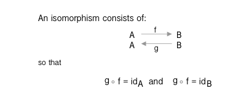

[series banner](../resources/glitched-abstract.jpg)

> **Note: This is** **Tutorial 26** **in the series** **Make the leap from JavaScript to PureScript**. Be sure
> **to read the series introduction where we cover the goals & outline, and the installation,**
> **compilation, & running of PureScript. I’ll be publishing a new tutorial approximately**
> **once-per-month. So come back often, there’s a lot more to come!**
> 
> [Index](https:github.com/adkelley/javascript-to-purescript/tree/master/md) | [<< Introduction](https:github.com/adkelley/javascript-to-purescript) [< Tutorial 25](https:github.com/adkelley/javascript-to-purescript/tree/master/tut25)

In the [last tutorial](https://github.com/adkelley/javascript-to-purescript/tree/master/tut25/), we wrapped up natural transformations in functional programming.  In this tutorial, we'll move onto Isomorphisms and round trip transformations, which, spoiler alert, have nothing to do with running the same code on the client and server.

I borrowed this series outline, and the JavaScript code samples with permission from the egghead.io course Professor Frisby Introduces Composable Functional JavaScript by
Brian Lonsdorf — thank you, Brian! A fundamental assumption is that you've watched his [video](https://egghead.io/lessons/javascript-isomorphisms-and-round-trip-data-transformations) on the topic before tackling the equivalent PureScript abstraction
featured in this tutorial. Brian covers the featured concepts exceptionally well, and I feel it's better that you understand its implementation in the comfort of JavaScript.

You'll find the text and code examples for this tutorial on [Github](https://github.com/adkelley/javascript-to-purescript/tree/master/tut26/).  If you read something that you feel could be explained better, or a code example that needs refactoring, then please let me know via a comment or send me a pull request.  Also, before leaving, please give it a star to help me publicize these tutorials.

# What is an Isomorphism?

An Isomorphism is a set of two functions `from` and `to` such that composing them together is the same as doing nothing.  That is:

    from <<< to $ x == x
    to <<< from $ y == y
    
    -- or
    (from <<< to $ x) == (identity x)
    (to >>> from $ y) == (identity y)

From above, we also see that the result of these compositions is the same as applying the identity function to the value.  You can also think of `from` and `to` as functions `f` and `g`, so that more formally:

# Constructing the Isomorphism type constructor

In Brian's example, he constructed the isomorphism that takes a `to` and a `from` into a type with the following javascript:

    const Iso = (to, from) =>
    ({
      to,
      from
    })

Then, as an example, he turned a string into a list of characters using an isomorphism.

    const chars = Iso(s => s.split(''), c => c.join(''))
    
    const res = chars.from(chars.to('hello world'))
    console.log(res)
    
    /* Terminal output
     * "hello world"
    */

You can check to see that it actually split on every character by getting rid of `chars.from`, to return `[ 'h', 'e', 'l', 'l', 'o',' ', 'w', 'o', 'r', 'l', 'd']`.

In purescript, we can construct a type for an Isomorphism with the following constructor, and its methods:

    data Iso a b = Iso (a -> b) (b -> a)
    
    inverse :: forall a b. Iso a b -> Iso b a
    inverse (Iso f g) = Iso g f
    
    to :: forall a b. Iso a b -> a -> b
    to (Iso f _) = f
    
    from :: forall f g a b. Iso f g -> b -> a
    from = to <<< inverse

The function `to` takes two arguments, the `Iso a b` type constructor, where `a` and `b` are functions, and the value `a` to be transformed.  Using PureScripts pattern matching, we match on the first function and use it to transform our `a` value.  The function `from` is similar, but in this case, we are transforming a `b` value to an `a` value.  Now, matching the JavaScript example above, let's use this isomorphism to turn a string into a list of characters.  First, we create our `Iso` type constructor:

    chars :: Iso String (Array String)
    chars = Iso (split (Pattern "")) (joinWith "")

From the above, similar to the JavaScript example, our `Iso a b` is constructed using the `chars` function.  Thus, `to chars a`  transforms a string `a` into a character array, and `from chars b` takes a character array `b` and transforms it to a string.  Using purescript's REPL, we can test both sides to ensure we've constructed this isomorphism correctly:

    pulp psci
    > import Main
    > to chars "hello world"
    ["h","e","l","l","o"," ","w","o","r","l","d"]
    > from chars <<< to chars $ "hello world"
    "hello world"
    > (from chars <<< to chars $ "hello") == (identity "hello")
    true

# Why are isomorphisms useful?

Isomorphisms are utilized in everyday programming because they make additional methods available to our types. For example, using our `chars` isomorphism from above, we're essentially making javascript's applicable array methods available to any string by turning it into an array of characters. Then, after applying one or more array methods, we turn it right back into a string.  For example, imagine we want to truncate the first three characters of a string and concatenate `"..."` to its tail. By using an isomorphism, we can take advantage of the array methods `slice` and `concat` to accomplish this task:

    truncate :: String -> String
    truncate xs = from chars $ concat [slice 0 3 $ to chars xs, ["..."]]
    
    main =
      -- returns "hel..."
      log $ truncate "hello world"

Let's make another isomorphism that proves a singleton array of `String` (i.e., an array holding one string value) is isomorphic to `Either String String`. First, we determine our isomorphism, naming it `single`:

    -- Input must be non-empty array or Just a
    single ::Iso (Either String String) (Array String)
    single = Iso (fromFoldable) (first)
    
    first :: Array String -> Either String String
    first [] = Left ""
    first xs = Right $ fromMaybe "" $ head xs

Note that we're using `fromFoldable` from the `Data.Array` module to take our `Either` constructor and turn it into an array.  This natural transformation works because type constructors such as `Maybe` and `Either` are foldable and, therefore, can become an array.  Note that if our `Maybe` or `Either` value is `Nothing` or `Left e` respectively, then an empty array is returned.  By default, the function `head` from `Data.Array` returns a `Maybe` value, so we'll transform it to an `Either` constructor using a natural transformation (see [Tutorial 25](https://github.com/adkelley/javascript-to-purescript/tree/master/tut25)). Now that we have our isomorphism, let's go ahead and test it in the REPL by turning our `Either` into an array so that we can later filter it using available array methods.

    pulp psci
    > import Main
    > import Data.Either
    > to single (Right "Hello")
    ["Hello"]
    > from single ["Hello"]
    (Right "Hello")

    filterEither :: (String -> Boolean) -> Either String String -> Either String String
    filterEither pred m = from single $ filter pred $ to single m

Testing our filter in the REPL produces the following results:

    pulp psci
    > import Main
    > import Data.Either
    > toUpper <$> filterEither (\x -> contains (Pattern "h") x) (Right "hello")
    (Right HELLO)
    > toUpper <$> filterEither (\x -> contains (Pattern "h") x) (Right "eello")
    (Left "")

# Summary

In this tutorial, we covered isomorphisms and delved into a couple of use cases in everyday coding. Like many concepts in functional programming, isomorphisms come directly from category theory.  So if you're interested in learning more about their properties, then I highly recommend you look at Bartosz Milewski's [blog](https://bartoszmilewski.com/2015/04/07/natural-transformations/) or [video](https://www.youtube.com/watch?v=2LJC-XD5Ffo) on this topic; but also category theory in genneral. In the next tutorial, we'll embark on the first of the final three posts in this series that ultimately will find common ground between two music artists using the [Spotify API](https://developer.spotify.com/console/).  If you are enjoying these tutorials, then please help me to tell others by recommending this article and favoring it on social media.  Until next time.

